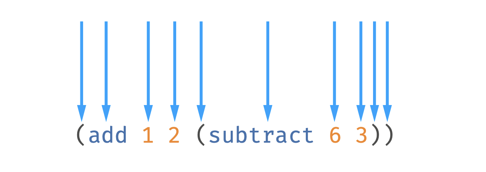

# a programming language

1. Install language, clone this repo then:
   ```zsh
   npm link
   ```
1. Run this in terminal for REPL:

   ```js
   > (add pi 1)
   4.141592653589793
   > (add pi 0)
   NaN
   > (add pi 1 (subtract 1 2))
   3.141592653589793
   >
   ```

1. Run speficic files in a `.msaki` extension

   ```js
   // example.msaki
   (add pi (subtract 3 (multiply 3 (min 1 (max 1 2 3 (modulo 1000 3))))))
   ```

   ```zsh
   msaki run examples/example.msaki
   ```

## Getting Started

Make sure you have the testing framework [jest](https://jestjs.io/docs/getting-started)

```zsh
npm install --save-dev jest
```

## Inspirations

- Peter Norvig's [lispy](https://norvig.com/lispy.html) - a lisp written in python
- Eloquent javascript Chapter 12 - [Egg programming language](https://eloquentjavascript.net/12_language.html)
- Jamie Kyle's [Super tiny compiler](https://github.com/jamiebuilds/the-super-tiny-compiler)

## 1. Stages of a compiler

1. **Parsing**: take source code and turn it to a representation of that code
1. **Trasnformation**: take source code ans turn it to whatever the compiler wants it to do
1. **Generation**: take transformation and turn it into a new string of code

### a) Parsing

1. **Lexical analysis**: take a string of code and turn it into tokens
   
1. Syntactic analysis
1. Psychoanalysis

> how might a lexer work?

1. Accept an input string of code.
1. Create a variable for tracking our position, like a cursor.
1. Make an array of tokens.
1. Write a while loop that iterates through the source code input.
1. Check each token. See if it matches one of your types.
1. Add it to the array of tokens.

## parsing

1. see [AST Explorer](https://astexplorer.net/#/gist/1819fd0f4c1e3690539a1257c054016a/bc5b7c792483456d5a48ba5c668acde715b9a6ab)
1. see [estree spec](https://github.com/estree/estree#the-estree-spec)

## repl

1. **R**ead
1. **E**valuate
1. **P**rint
1. **L**oop

## resources

You can follow along [here](http://static.frontendmasters.com/resources/2019-05-31-build-your-own-programming-language/programming-language.pdf)
